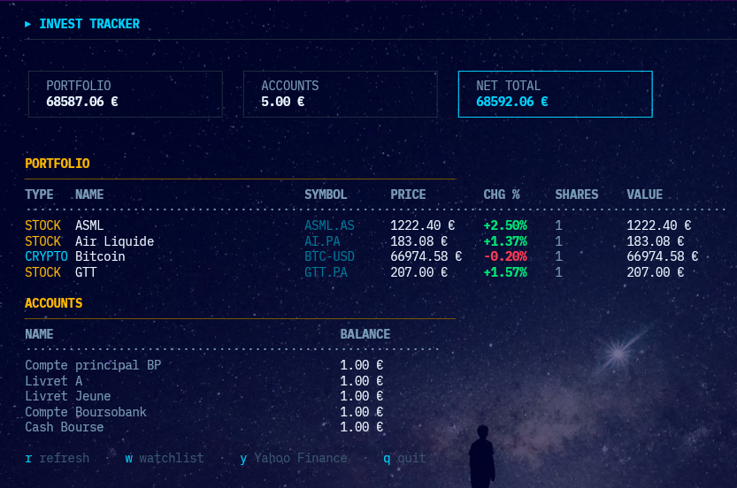
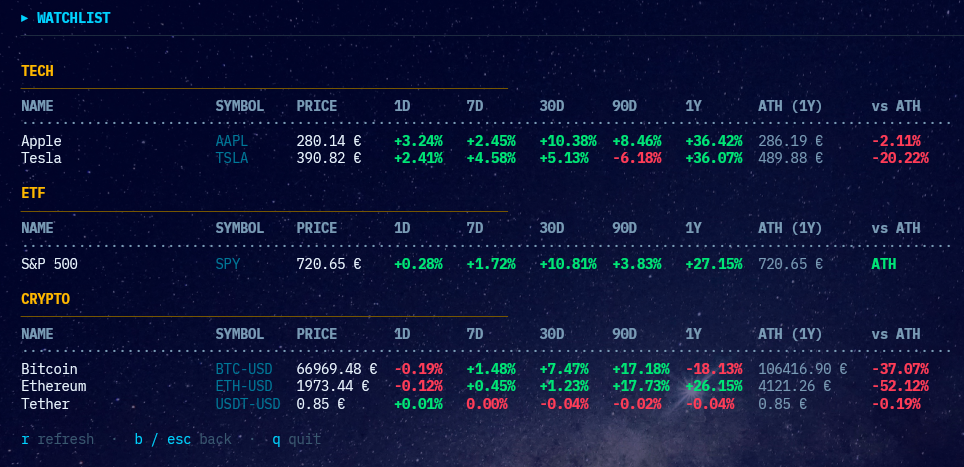

# invest-tracker-tui

Minimal terminal finance tracker using Go and Bubble Tea.

## Usage

```bash
git clone <repo>
cd invest-tracker-tui
go mod tidy
go run .
```

Controls: `r` = refresh, `w` = open your watchlist, `y` = open Yahoo Finance, `q` = quit.

## Quick explanation

Simple finance tracker for terminal. `portfolio.json` stores stocks, cryptos (BTC/ETH/SOL), and bank accounts. Fetches live prices from Yahoo Finance and displays clean TUI. Basic interface for personal use—edit config or code to customize. And `watchlist.json` stores stocks, cryptos that you monitor.



